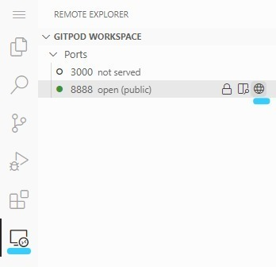

# Web Calculator

Uma calculadora web para operações básicas, escrita em Kotlin e compilada em Javascript.

## Inicialização
:one: Primeiramente, acesse o projeto no [GitPod](https://gitpod.io/github.com/Rafarinh0/projeto-lpf)

:two: No terminal do editor de texto, instale o [SDK](https://kotlinlang.org/docs/command-line.html) do Kotlin no GitPod.
```bash
sdk install kotlin
```

:three: Por fim, execute o servidor em qualquer porta disponível, e torne-a pública.
```bash
php -S 0.0.0.0:8888
```


## Screenshots


# Desenvolvedores
<table>
  <tr>
    <td align="center">
      <a href="https://github.com/Rafarinh0">
        <br>
        <sub>
          <b>Rafael Marinho</b>
        </sub>
      </a>
    </td>
    <td align="center">
      <a href="https://github.com/Vinizik">
        <br>
        <sub>
          <b>Vinicius Martins</b>
        </sub>
      </a>
    </td>
  </tr>
</table>
